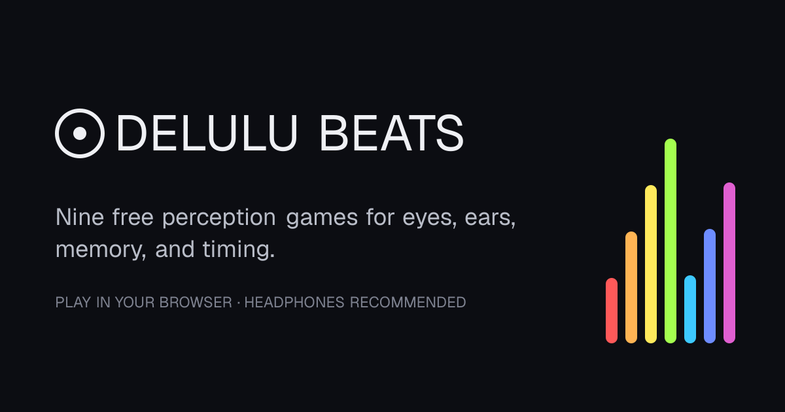
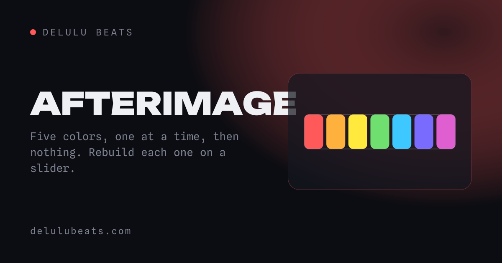
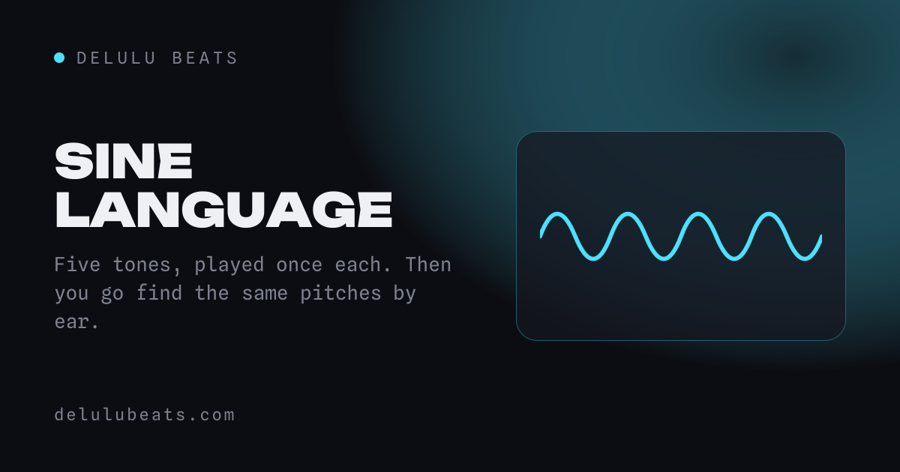
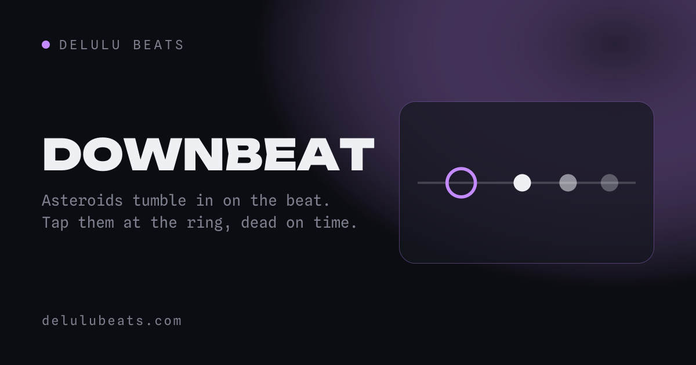
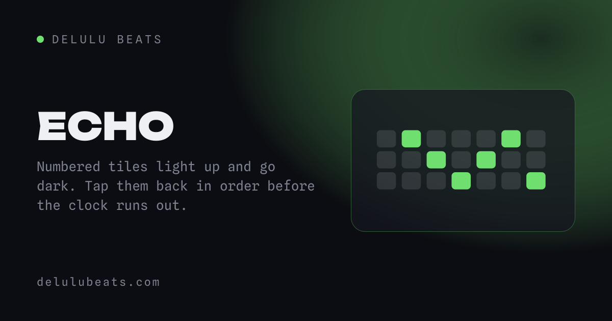
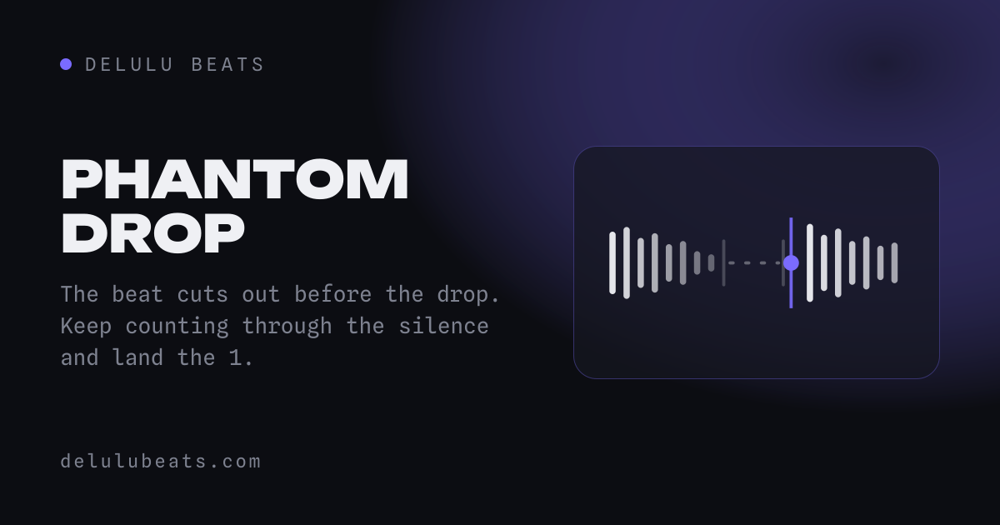
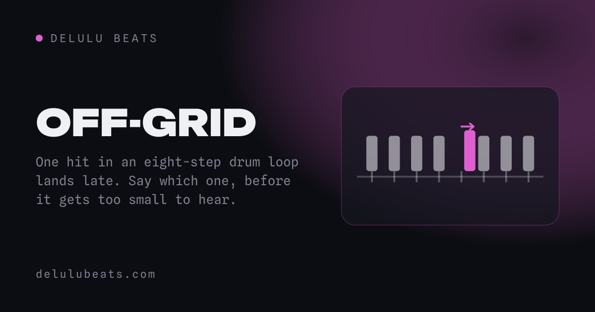

# Delulu Beats: free browser rhythm and perception games

[](https://delulubeats.com/)

Delulu Beats is a collection of nine full-screen perception games for color, pitch,
duration, rhythm, spatial memory, and melody. See it, hear it, remember it, then try to dial it
back in. It also includes Beat Lab, a browser-based studio for building and downloading your own
rap, R&B, or house loop.

**[Play Delulu Beats](https://delulubeats.com/)** — free, with no account or installation required.

## Games

| Game | Challenge | How it works |
| --- | --- | --- |
| **Afterimage** | Color memory | Rebuild five colors from memory with HSL controls |
| **Sine Language** | Pitch memory | Hear five tones, then recover each pitch on a frequency slider |
| **Second Sense** | Time perception | Feel each duration, then hold and release to recreate it without a clock |
| **Downbeat** | Rhythm and timing | Follow the track and hit each incoming note on the beat |
| **Echo** | Spatial memory | Recall numbered tiles on increasingly difficult grids before time runs out |
| **Refrain** | Melody memory | Replay a piano phrase that grows by one note each level |
| **Fever Dream** | Beat memory | Read a microwave's movement, then feed the rhythm back with eight taps |
| **Phantom Drop** | Internal timing | Keep time through a silent bar and catch the returning drop |
| **Off-Grid** | Microtiming | Find the one late hit hidden inside a repeating drum loop |

## Screenshots

| | |
| --- | --- |
| [](https://delulubeats.com/color/) | [](https://delulubeats.com/sound/) |
| [](https://delulubeats.com/tempo/) | [](https://delulubeats.com/memory/) |
| [](https://delulubeats.com/phantom/) | [](https://delulubeats.com/offgrid/) |

## What's included

- Free Play and a seeded **Daily** challenge shared by everyone at each difficulty
- An optional shared **leaderboard** for the daily, ranked alongside
  [Shut The Cube](https://shutthecube.com) on the same board — sign in with Google if you want a
  name on it, or ignore it entirely and nothing leaves your browser
- Easy, Hard, and Brutal difficulty levels, plus a fourth Medium level in Downbeat
- **One at a time** and **All five first** recall formats for Afterimage and Sine Language
- Warm, Pure, Organ, and Chip tone voices in Sine Language
- Punch, Boom, Club, and Wood sampled drum kits in Downbeat, with a synthesized fallback
- Curve, Orbit, and Rain note lanes plus selectable tracks in Downbeat
- Flash and Trail reveal formats in Echo
- Watch and By ear formats plus selectable phrase styles in Refrain
- Mouse, keyboard, and touch input, including a playable on-screen piano
- Per-mode best scores, play counts, daily streaks, saved preferences, and new-best celebrations
- Shareable emoji score cards with native sharing, clipboard fallback, and WhatsApp sharing
- Built-in How to play guides, audio feedback, fullscreen mode, and four animated backgrounds
- Beat Lab with mix-and-match drums, bass, chords, melody, vocal chops, and track download

Keyboard shortcuts appear in each game. Common controls include number keys for difficulty,
`D` for Daily, `Enter` to start, `Esc` to return to the menu, and `F` for fullscreen.
Contextual shortcuts are shown for sound, format, beat, and background options.

## Stack

- Next.js App Router with static export
- React and TypeScript
- [Motion](https://motion.dev) for interface transitions
- Web Audio API for synthesized voices, drum playback, effects, and timing
- Canvas for waveforms, rhythm lanes, and animated backgrounds

## Develop

```bash
npm install
npm run dev      # http://localhost:3000
npm run lint
npm run build    # static export to out/
```

Pushes to `main` deploy automatically to GitHub Pages at
[delulubeats.com](https://delulubeats.com/).

## About and credits

Delulu Beats was created and vibe-coded by Oliver Saly and his dad, Victor Saly.
The [source code is available on GitHub](https://github.com/victorsaly/delulubeats).

The games draw inspiration from playful browser experiments such as
[Neal.fun](https://neal.fun/) and the perception-game genre popularized by
[dialed.gg](https://dialed.gg/). Delulu Beats is an original, independent project and is not
affiliated with either site.
